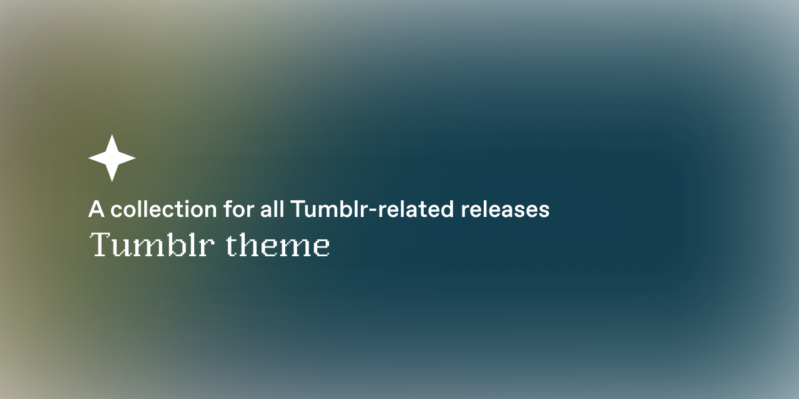

# Tumblr Themes
> A collection or repository for all Tumblr-related releases especially for custom Tumblr themes and pages.

 

## License
The source code to the website is available under the MIT License

## List of released themes
| No  | Theme Name    | Last Updated | Preview                             | Install | NPF Compatible |
| --- | ------------- | ------------ | ----------------------------------- | ------- | ------ |
| 1   | Nyiur         | Sept 19, 2023 |  https://nyiur-theme.tumblr.com/    | [Source code](https://github.com/fukuo-themes/tumblr-theme/blob/main/nyiur-theme/nyiur-theme.html)     | Yes |
| 2   | Renjana       | Sept 23, 2023  |  https://renjana-theme.tumblr.com/  | [Source code](https://github.com/fukuo-themes/tumblr-theme/blob/main/renjana-theme/renjana-theme.html)        | Yes |
| 3   | Empati Tamako | Sept 30, 2023 |  https://empati-theme.tumblr.com/   | [Source code](https://github.com/fukuo-themes/tumblr-theme/blob/main/empati-theme/empati-theme.html)        | Yes |

## Credits
* no.js photosets by [annasthms and espoirthemes](https://href.li/?https://github.com/annasthms/photosets)
* tumblrControls.js by [rachaelthemes](https://href.li/?https://rachaelthemes.com/tumblr-control)
* npfPhotosets() plugin by [codematurgy](https://href.li/?https://github.com/boscoxvi/npfphotosets)
* undoPhotoset() plugin by [annasthms](https://annalogs.tumblr.com/photosets)
* Expanded Tumblr localization by [codematurgy](https://href.li/?https://github.com/boscoxvi/expandedtumblrlocalization)
* Minimal Soundcloud player by [shythemes](https://shythemes.tumblr.com/post/114792480648/minimal-soundcloud-player)
* Tippy.js by [atomiks](https://atomiks.github.io/tippyjs/)
